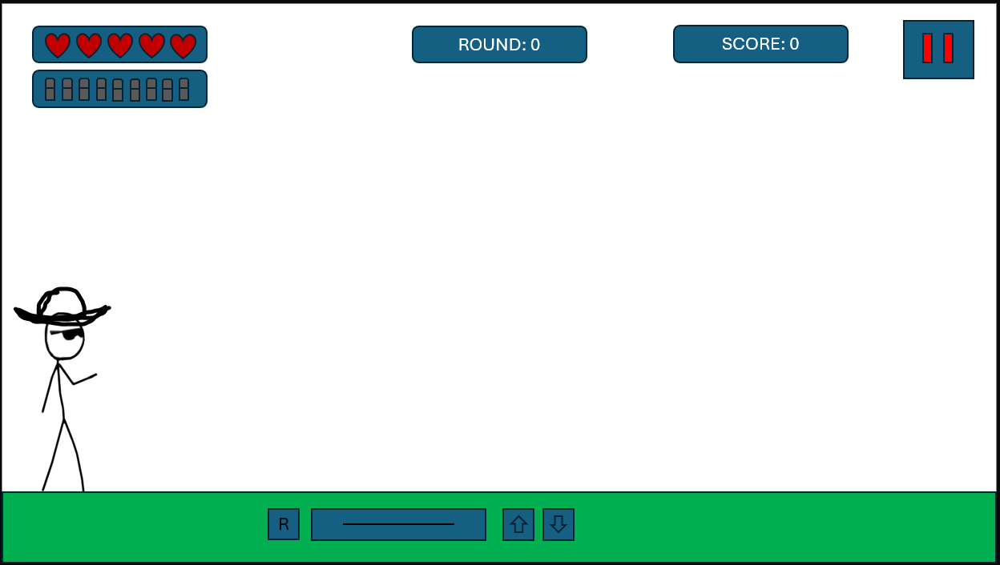

Game idee
In Dead Angle speel je als een cowboy in een vaste 2D-ruimte. Je moet stuiterende ballen kapotschieten door slim gebruik te maken van muren en weerkaatsende kogels. Je hebt meerdere levens, zodat je een paar keer geraakt kunt worden voordat het echt Game Over is.

schermen
Scherm 1: main screen
Scherm 2: moeilijkheidsgraad kiezen
Scherm 3: do you want to play tutorial scherm
Scherm 4: korte tutorial
Scherm 5: gameplayscherm
Scherm 7: settings van main menu
Scherm 8: settings tijdens gameplay
Scherm 9: Difficulty change warning
Scherm 10: pauze scherm
Scherm 11: waarschuwing spel leaven
Scherm 12: game over

gamplay scherm voorbeeld

verzorg de style en zorg dat alles werkt
